# Laberinto, Ratón y Queso
___
 
Juego hecho en Java en el cual se tiene un laberinto representado por una matriz de números enteros, en el cual se encuentra un ratón que debe encontrar el queso.   

Los números en la matriz representan lo siguiente:
* 0: Casilla libre para que el ratón pase.
* 1: Casilla donde hay una pared.
* 3: Casilla en la cual se ubica el Queso.
* 4: Casilla en la cual se ubica el Ratón.
  
El laberinto varia cada vez que se ejecuta el juego. Además el número de filas y columnas de la matriz lo introduce el usuario.

## Como se Juega?
---
1. Se deben abrir tres archivos: _Interacción.java_, _Laberinto.java_ y _Raton.java_, en un IDE para Java.  
  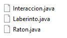 
  1. Una vez abierto, se selecciona _Interaccion.java_ y se da click en el botón de Ejecutar/Run, el cual usualmente se representa con una flecha. 
  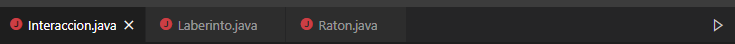 
  1. A continuación aparecerá una ventana con el titulo del juego. Dar click en el botón **OK** para continuar. 
  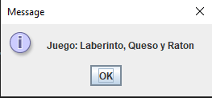 
  1. Luego, se muestra una introducción del mismo. Presionar **OK** para continuar.  
  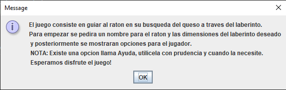 
  1. Luego se solicitará que introduzca un nombre para su ratón. 
  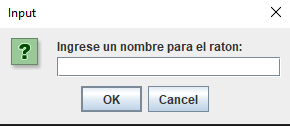 
  1. Despues podrá ingresar el numero de filas que desea para la matriz del laberinto. 
  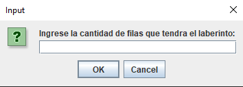 
  1. Seguido se podrá ingresar el numero de columnas que se desea para la matriz del laberinto. 
  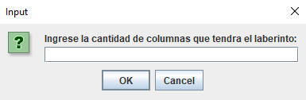 
  1. Seguido se tendré el menu con las opciones de juego. 
  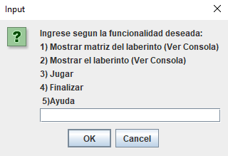  

  * La opción **1)**, muestra en la consola del IDE la matriz generada para ser el laberinto. Al inicio de este escrito se describio lo que cada número representa. 
  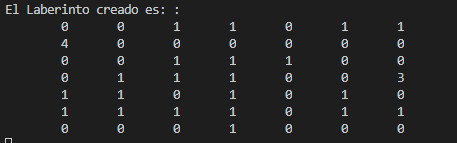  
  * La opción **2)**, muestra en la misma consola la representación del laberinto. Los **#** representan las casillas bloqueadas/donde hay pared. **R** indica la posicion del ratón. **Q** ubica la casilla en la cual se encuentra el queso. Las demás son casillas libres. 
  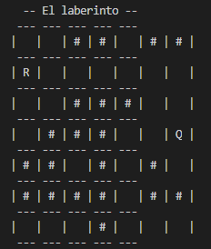  
  * La opción **3)**, dirije a otro menú. En este se listan unos números y la dirección a la cual se moverá el ratón al seleccionarlos. Si hay una pared en la dirección seleccionada o si se trata de uno de los limites del laberinto, el programa lo indicará.  
  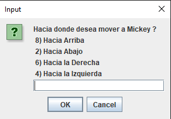  
  * La opción **4)** finalizará el juego, dandole las gracias por jugar.  
  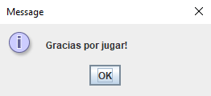  
  * La opción **5)** es la ayuda. Al inicio del juego se indica utilizarla con prudencia, ya que la misma se encarga de demoler paredes y se aconseja utilizarla en casos realmente necesarios. 
  **Nota:** Creemos en la capacidad de su ratón, por lo que sabemos que no la necesitara con frecuencia.  
  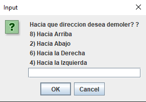 
  A continuación se presenta un ejemplo de antes y despues de demoler la pared superior: 
  Antes:
  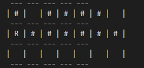 
  Despues:
  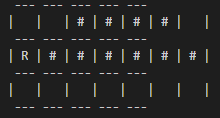  
  
  Al dar click al botón **Cancelar**, se avisará que se le dió click a la opción de cancelar, se agradecerá y posteriormente se cerrará. 
  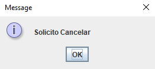 
    
  Cuando el ratón haya llegado hasta el queso, un mensaje de _Felicidades_ aparecera en su pantalla. 
  

  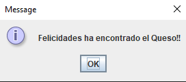

___
___
